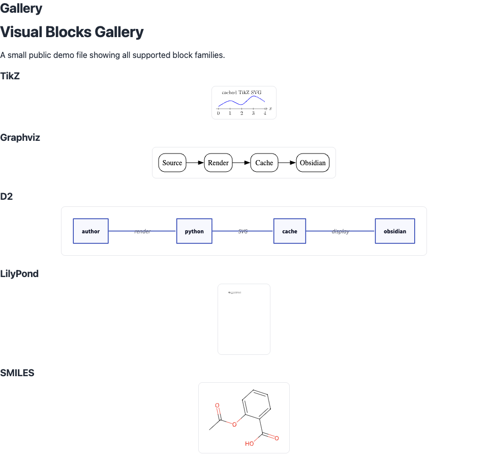
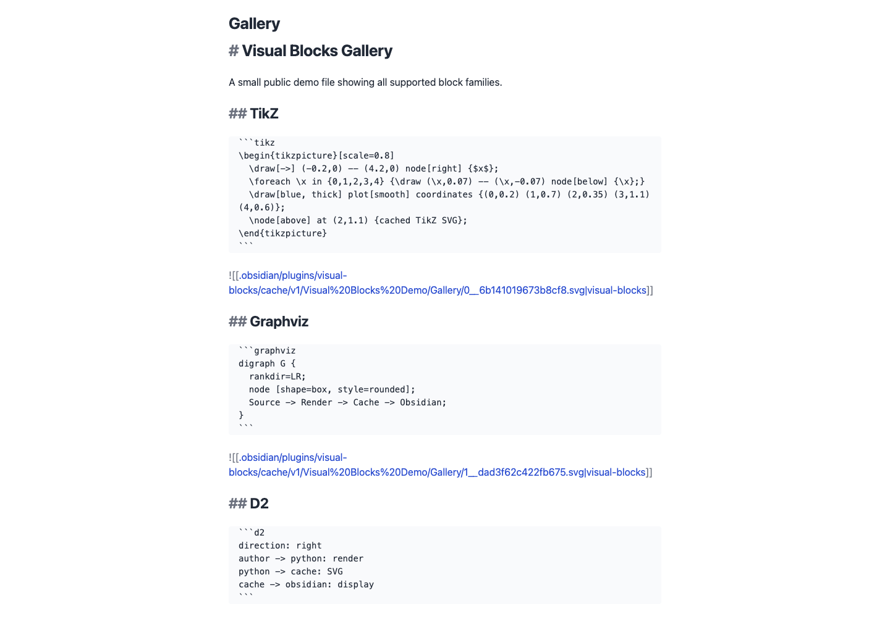
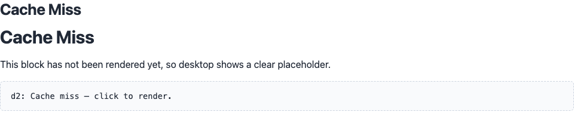
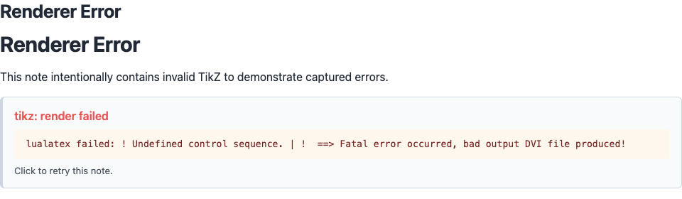
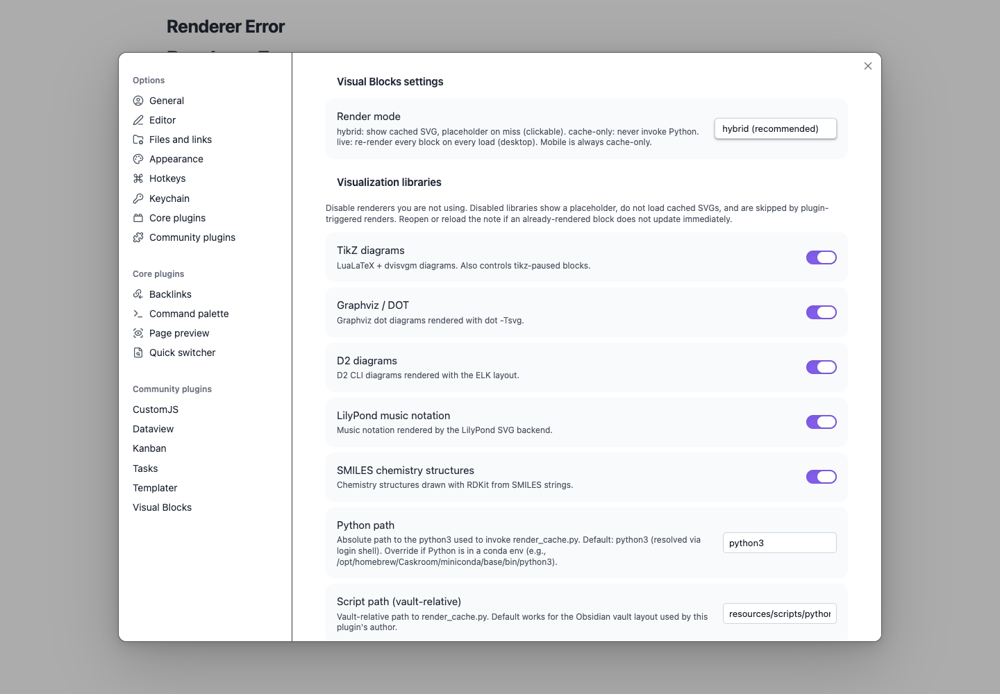
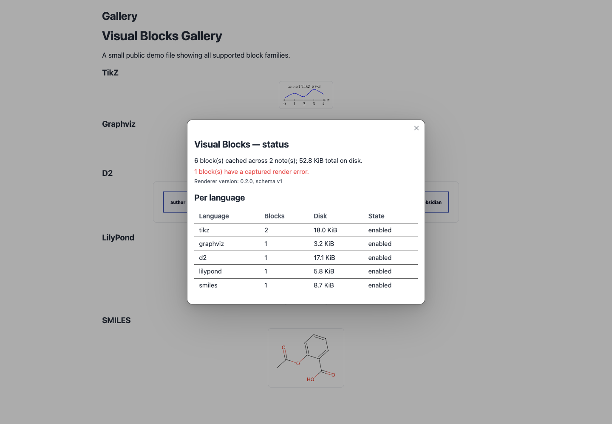

# Visual Blocks

**Last Updated:** 2026-05-04
**Version:** 0.5.0

Visual Blocks turns supported fenced code blocks into cached SVG visuals in
Obsidian. Rendering is done by the Python pipeline at
`resources/scripts/python_single/render_cache.py`; the Obsidian plugin is the
viewer and command surface.

The design is cache-first:

1. You write a supported fenced code block in a note.
2. `render_cache.py` renders it to an SVG under
   `.obsidian/plugins/visual-blocks/cache/v1/`.
3. Visual Blocks replaces the code block in reading/live-preview views with the
   cached SVG.
4. On mobile, the plugin only reads the cache. It never tries to spawn Python.

## Screenshots

These screenshots were captured from an isolated synthetic Obsidian vault. They
do not contain private notes or live vault cache data.

**Rendered gallery:** one note with cached TikZ, Graphviz, D2, LilyPond, and
SMILES blocks.



**Source view:** the same note remains editable as ordinary fenced code blocks
and generated cache refs.



**Cache miss:** a supported block that has not been rendered yet shows a clear
desktop placeholder.



**Renderer error:** failed renders are recorded and shown inline instead of
spinning forever.



**Settings:** render mode, language toggles, Python path, script path, and
desktop save-hook controls.



**Cache status:** the command palette status modal summarizes cached blocks,
disk use, language totals, and captured errors.



## Installation

This repository is the source of truth for the Visual Blocks plugin. Deploy
runtime files into an Obsidian vault; do not symlink the plugin folder because
the cache must stay inside the vault for sync and mobile use.

In the vault, the plugin is installed at:

```text
.obsidian/plugins/visual-blocks/
```

To enable it:

1. Open Obsidian settings.
2. Go to Community plugins.
3. Enable `Visual Blocks`.
4. Keep TikZJax disabled for this visual pipeline. Visual Blocks is the
   canonical renderer/viewer for TikZ diagrams in this vault.

The plugin is mobile-capable (`isDesktopOnly: false`), but rendering commands
only work on desktop because they call Python.

## Deploy To A Vault

Build the plugin first:

```bash
npm run build
```

Review the deploy plan:

```bash
scripts/deploy-to-vault.sh --dry-run /Users/cs/Obsidian/_
```

Run the deploy after reviewing the dry-run:

```bash
scripts/deploy-to-vault.sh /Users/cs/Obsidian/_
```

The deploy copies plugin runtime files and Python renderer files only. It never
copies or deletes:

- `.obsidian/plugins/visual-blocks/cache/`
- `.obsidian/plugins/visual-blocks/data.json`
- `.obsidian/plugins/visual-blocks/node_modules/`

After deployment, reload the Visual Blocks plugin in Obsidian and open a note
with a known cached TikZ or D2 block. The cache should remain under
`.obsidian/plugins/visual-blocks/cache/` inside the vault.

## Supported Languages

Visual Blocks handles these fenced code-block languages:

| Fence | Renderer | Output |
|-------|----------|--------|
| `tikz` | LuaLaTeX + dvisvgm | SVG |
| `tikz-paused` | Canonicalized as `tikz` | SVG |
| `graphviz` | `dot -Tsvg` | SVG |
| `d2` | D2 CLI with ELK layout | SVG |
| `lilypond` | LilyPond SVG backend | SVG |
| `smiles` | RDKit molecule drawer | SVG |

Mermaid is intentionally not handled by this plugin. Obsidian's native Mermaid
renderer remains responsible for Mermaid blocks.

Example:

````markdown
```d2
api -> queue -> store
```
````

After rendering, the note also contains a durable cache reference:

```markdown
![[.obsidian/plugins/visual-blocks/cache/v1/path/to/note/0__HASH.svg|visual-blocks]]
```

Visual Blocks hides Obsidian's native rendering of that cache reference and
shows the plugin-owned image instead.

## Settings

Open Settings -> Community plugins -> Visual Blocks.

| Setting | Default | Meaning |
|---------|---------|---------|
| Render mode | `hybrid` | Normal display behavior on desktop |
| Visualization libraries | All on | Per-language toggles for TikZ, Graphviz, D2, LilyPond, and SMILES |
| Python path | `python3` | Python executable used for render commands |
| Script path | `resources/scripts/python_single/render_cache.py` | Vault-relative renderer script |
| Re-render on save | On | Desktop save hook for supported blocks |
| Spawn through login shell | On | Uses `$SHELL -lc` to inherit Homebrew/conda paths |

The visualization-library toggles let you disable renderers you are not using.
For example, if you are not writing music notation, turn off LilyPond. Disabled
libraries show a small placeholder instead of loading cached SVGs, and plugin
commands skip them when spawning Python.

Disabling a library does **not** delete existing cache files or markdown refs.
If you re-enable the library later, existing cache entries can be reused when
the source hash still matches.

If render commands fail because Python cannot import dependencies such as
`rdkit`, set Python path to the verified conda interpreter. On this machine that
has usually been:

```text
/opt/homebrew/Caskroom/miniconda/base/bin/python
```

## Render Modes

| Mode | Desktop behavior | Mobile behavior |
|------|------------------|-----------------|
| `hybrid` | Show cache hits; cache misses are clickable | Forced to `cache-only` |
| `cache-only` | Show cache hits; never invoke Python | Same |
| `live` | Re-render in the background; show stale cache while it runs | Forced to `cache-only` |

Mobile always acts as `cache-only`. This is intentional: iOS Obsidian cannot
spawn the Python renderer, so mobile should display only already-rendered SVGs
or a clear "open on desktop to render" placeholder.

## Commands

Visual Blocks registers seven command-palette commands:

| Command | What it does |
|---------|--------------|
| Refresh this block | Render the supported block under the cursor |
| Refresh all blocks in this note | Force-render every block in the active note |
| Refresh entire vault (with confirmation) | Force-render all blocks under scan roots |
| Show cache status | Show cache counts, disk usage, errors, and language totals |
| Sweep orphan cache files | Remove SVGs no longer referenced by source blocks |
| Toggle render mode (hybrid -> cache-only -> live) | Cycle desktop render mode |
| Clear entire cache (DESTRUCTIVE) | Delete all cached files after confirmation |

Use `Clear entire cache` only when you are ready to rebuild with
`Refresh entire vault` or the command line.

## Normal Workflow

Render one note:

```bash
python resources/scripts/python_single/render_cache.py kn/math/concepts/example.md
```

Force-render one note:

```bash
python resources/scripts/python_single/render_cache.py kn/math/concepts/example.md --force
```

Render every supported block in the scan roots:

```bash
python resources/scripts/python_single/render_cache.py --all
```

Render only selected languages from the command line:

```bash
python resources/scripts/python_single/render_cache.py --all --languages tikz,d2,smiles
```

Sweep stale cache files:

```bash
python resources/scripts/python_single/render_cache.py --sweep
```

From Obsidian desktop, prefer the command palette for one-block and one-note
refreshes. Use the command line for bulk operations when you want full terminal
output.

By default, direct terminal commands process all supported languages. The plugin
passes `--languages` automatically based on your enabled visualization-library
settings.

## Status And Errors

The status bar shows the state of the active note:

| Status | Meaning |
|--------|---------|
| `✓ N item(s)` | This note has N cached blocks and no recorded failures |
| `rendering...` | A desktop render command is currently running |
| `⚠ N failed` | N blocks have captured renderer errors in `index.json` |
| `N disabled block(s)` | This note has cached blocks only for disabled libraries |
| `no cache` | The active note has no Visual Blocks cache entry |

Click the status-bar item to open the cache-status modal.

If a render fails, Visual Blocks shows an inline error block instead of an
infinite spinner. On desktop, click the error block to retry the note. On
mobile, open the note on desktop to retry.

## Cache Layout

Canonical cache files live here:

```text
.obsidian/plugins/visual-blocks/cache/
|-- index.json
`-- v1/
    `-- <vault-relative-note-path-without-.md>/
        `-- <zero-based-block-index>__<16-char-source-hash>.svg
```

The markdown source reference uses the same path plus the `visual-blocks` alt
tag. Legacy `tikz-cache` and transitional `render-cache` refs are still parsed
by the migration/markdown helpers, but new refs should use `visual-blocks`.

## Troubleshooting

**Cache miss on desktop**

- Run `Refresh this block` with the cursor inside the block.
- Or run `Refresh all blocks in this note`.
- If Python fails, set the plugin's Python path to the conda interpreter.

**Cache miss on mobile**

- Open the note on desktop and render it there.
- Let the vault finish syncing.
- Reopen the note on mobile.

**Renderer error shown inline**

- Read the captured error message.
- Fix the source block.
- Retry from desktop.

**A block says the library is disabled**

- Open Settings -> Community plugins -> Visual Blocks.
- Re-enable the corresponding visualization library.
- Reopen or reload the note if an already-rendered view does not update
  immediately.

**SVG appears twice or Obsidian says the cache file cannot be found**

- Reload the Visual Blocks plugin.
- Confirm the note uses `|visual-blocks` cache refs.
- Confirm `.obsidian/plugins/visual-blocks/styles.css` is loaded; it hides
  Obsidian's native embed wrapper for plugin-managed cache paths.

**TikZJax spinner still appears**

- Disable TikZJax for this vault.
- Visual Blocks is the canonical TikZ viewing path; live TikZJax rendering was
  intentionally replaced because several title-node/math patterns hung without
  a useful error.

## Development

Run plugin tests:

```bash
npm test -- --runInBand
```

Build the plugin:

```bash
npm run build
```

Run the Python renderer tests:

```bash
/opt/homebrew/Caskroom/miniconda/base/bin/python -m pytest \
  resources/scripts/python_single/tests -q
```

After editing `.obsidian/plugins/visual-blocks/`, run the Obsidian harness
or canary scenario before claiming the plugin still loads cleanly.

When running the Python renderer outside a vault root, set
`VISUAL_BLOCKS_VAULT_ROOT`:

```bash
VISUAL_BLOCKS_VAULT_ROOT=/Users/cs/Obsidian/_ \
  /opt/homebrew/Caskroom/miniconda/base/bin/python \
  resources/scripts/python_single/render_cache.py --all --dry-run
```
