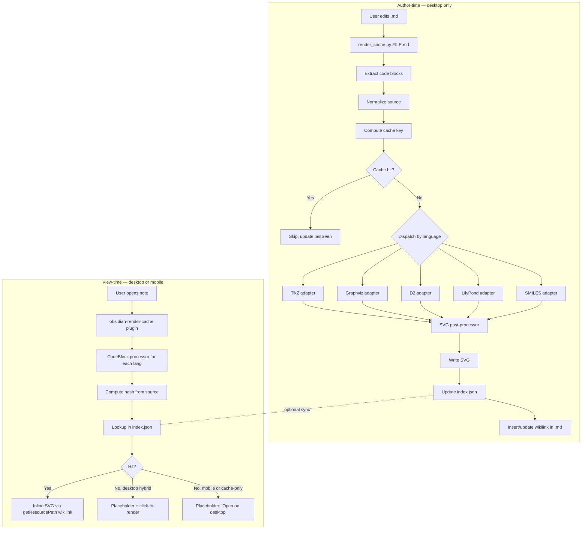

# Obsidian Render Cache — Specification

**Status:** Draft
**Created:** 2026-04-26
**Last Updated:** 2026-04-26
**Author:** Christian Stelmach
**Slug:** `render-cache`
**Predecessor:** `docs/specs/tikz-cache/` (TikZ-only PNG pipeline; superseded)
**Companion plan:** `docs/specs/render-cache/PLAN.md` (per-task implementation detail)

**Research grounding (8 reports under `/tmp/`):**
- `gemini-research-tikzjax-foundation-20260426.md`
- `gemini-research-obsidian-caching-mobile-20260426.md`
- `gemini-research-rendering-alternatives-20260426.md`
- `gemini-research-caching-architecture-20260426.md`
- `gemini-research-universal-renderer-20260426.md`
- `gemini-research-best-of-breed-tools-20260426.md`
- `gemini-research-multilang-patterns-20260426.md`
- `gemini-research-mobile-cacheable-formats-20260426.md`

---

## Table of Contents

1. [Project Overview](#1-project-overview)
2. [Goals & Success Criteria](#2-goals--success-criteria)
3. [Architecture & Design](#3-architecture--design)
4. [Decisions & Rationale](#4-decisions--rationale)
5. [Implementation Phases](#5-implementation-phases)
6. [Constraints & Boundaries](#6-constraints--boundaries)
7. [Rejected Alternatives](#7-rejected-alternatives)
8. [Verification Strategy](#8-verification-strategy)
9. [Open Questions](#9-open-questions)
10. [Glossary](#10-glossary)
11. [Approval](#11-approval)

---

## 1. Project Overview

### Name
**Obsidian Render Cache.**

### One-Paragraph Summary
A render-at-save system for code-described visualizations in an Obsidian vault. A
Python pipeline renders TikZ, Graphviz, D2, LilyPond, and SMILES code blocks into
hash-keyed SVGs at edit time. A small Obsidian plugin reads those SVGs and inlines
them in notes — the same way on macOS desktop and on iOS mobile, offline, with no
in-app rendering on mobile. Replaces the unmaintained `obsidian-tikzjax` plugin
for the user's vault and expands the diagram surface from TikZ-only to a curated
multi-language whitelist.

### Core Purpose
Eliminate iOS Obsidian crashes on diagram-heavy notes while expanding what can be
rendered, with deterministic caching that gives the user precise control over what
gets rendered when. The plugin never renders; it only displays. Rendering is the
job of the Python pipeline, which the user invokes (or has triggered on save) on
the desktop only.

### Stakeholders
- **Primary user:** Christian (sole vault user; macOS desktop + iOS mobile)
- **Implementation team:** the agent (or developer) executing `PLAN.md` phase by phase
- **Future maintainer:** anyone reading this spec to understand WHY decisions were made

### Why this exists (problems being solved)

1. **iOS Obsidian crashes** on TikZ-heavy notes. Root cause is `WKWebView` memory
   eviction during the WASM TeX engine's allocation pattern; not configurable in
   the existing plugin.
2. **Silent rendering failures** in the existing TikZJax plugin's `dvi2html` JS
   converter (e.g., title-node-at-coordinates bug). No error reaches the user;
   the diagram simply doesn't appear.
3. **Stale TeX Live snapshot** in TikZJax's WASM bundle (~2020-02-02). `pgfplots`
   1.18+ features fail. The toolchain that builds this WASM (`web2js`) has been
   abandoned since 2021-09-10.
4. **No diagrams beyond TikZ** in the user's current toolchain. Code-described
   chemistry, music notation, declarative graph diagrams (D2), and SMILES
   molecules are absent and would have to be drawn by hand.

### What "done" looks like (briefly, in user terms)

- The user runs `python3 render_cache.py FILE.md` (or saves a note with `triggerOnSave`
  enabled) and any TikZ/Graphviz/D2/LilyPond/SMILES block in the file becomes a cached
  SVG.
- The cached SVG appears inline in Obsidian on desktop and on iOS mobile, identically.
- Edits to a code block invalidate the cache automatically via hash; idempotent re-runs
  are no-ops.
- iOS Obsidian no longer crashes on previously-crashing notes.
- Silent failures are gone; bad code blocks render an inline error message instead.

The full Definition of Done is in §8 (Verification Strategy → Final Acceptance Test).

---

## 2. Goals & Success Criteria

### Must Have (v1)

| # | Goal | Success Criterion | Priority |
|---|------|-------------------|----------|
| G1 | Mobile no longer crashes on diagram-heavy notes | The 3 known crash-trigger notes open cleanly on iOS, no reload loop, page interactive within 2 s | Must Have |
| G2 | Native LaTeX fidelity for TikZ output | All existing TikZ blocks render correctly via `lualatex + dvisvgm`, with no degraded math layout on iOS (no Times New Roman fallback) | Must Have |
| G3 | Multi-language code-block rendering | TikZ, Graphviz, D2, LilyPond, SMILES code blocks all render to SVG via the dispatcher | Must Have |
| G4 | Hash-based cache invalidation | Source change → re-render; identical re-run → cache hit; preamble change → cascade re-render | Must Have |
| G5 | Three rendering modes | hybrid / cache-only / live, with mobile auto-overriding to cache-only | Must Have |
| G6 | Plugin commands | refresh-block, refresh-note, refresh-vault, show-status, sweep, toggle-mode, clear-all all functional from command palette | Must Have |
| G7 | Renderer hardening eliminates documented iOS failure modes | Cached SVG is path-only, `currentColor`-aware, has valid `viewBox`, hash-prefixed IDs | Must Have |
| G8 | Single source of truth | Python is canonical writer; plugin reads only | Must Have |
| G9 | Inline error display when render fails | TikZ syntax error → inline error block, no silent failure | Must Have |

### Should Have (v1)

| # | Goal | Success Criterion |
|---|------|-------------------|
| G10 | Status-bar progress indicator during batch operations | Progress count visible during `refresh-vault` |
| G11 | Migration tool moves legacy PNG cache to new layout | All 5 existing PNG refs converted to SVG; old dir empty |
| G12 | Per-phase user feedback gate | Each phase produces at least one user-visible artifact for sanity check (see §5 Verification rows) |

### Won't Have (v1)

These are explicitly deferred. See §6.1 (Out of Scope) and §9 (Open Questions).

| Goal | Why deferred |
|------|--------------|
| Live mobile rendering | Cache-only mobile is the chosen architecture (D03) |
| Programmatic animations (Manim, motion-canvas) | Architectural mismatch with the cache pattern (D08) |
| Forking TikZJax / WASM modernization | Wrong architecture (D01); web2js abandoned |
| Typst migration | Pre-1.0 ecosystem (D02) |
| Cloud rendering services | Offline-first hard constraint |
| Watch-mode auto-render daemon | Manual + on-save trigger sufficient (OQ2) |

---

## 3. Architecture & Design

### 3.1 Overview

The system splits cleanly along time: **author-time** (rendering happens at edit/save)
versus **view-time** (cache is read and inlined). Author-time runs on macOS desktop
only via a Python CLI/script. View-time runs on any Obsidian platform and only
requires the SVG file plus a small TypeScript plugin.

### 3.2 Component Interaction Diagram



### 3.3 Key Components

| Component | Purpose | Location | Phase |
|-----------|---------|----------|-------|
| `render_cache.py` | CLI entry point and dispatcher | `resources/scripts/python_single/render_cache.py` | Phase 2 |
| `render_cache.adapters.*` | Per-language rendering adapters (one Python class each) | `resources/scripts/python_single/render_cache/adapters/` | Phases 1, 3-6 |
| `render_cache.normalize` | Source canonicalization for stable hashing | `…/render_cache/normalize.py` | Phase 2 |
| `render_cache.hash` | Cache-key computation | `…/render_cache/hash.py` | Phase 2 |
| `render_cache.postprocess` | SVG hardening (ID-prefix, currentColor, viewBox) | `…/render_cache/postprocess.py` | Phase 7 |
| `render_cache.index` | Cache `index.json` reader/writer | `…/render_cache/index.py` | Phase 2 |
| `render_cache.markdown_io` | Code-block extraction + image-ref insertion | `…/render_cache/markdown_io.py` | Phase 2 |
| `tikz_cache.py` | Backward-compat shim (deprecation warning + forwards to render_cache.main) | `resources/scripts/python_single/tikz_cache.py` | Phase 2 |
| `obsidian-render-cache` plugin | Reads cache, inlines SVGs, exposes commands | `.obsidian/plugins/obsidian-render-cache/` | Phases 8-10 |
| `migrate_to_render_cache.py` | One-shot migration of legacy PNG cache | `resources/scripts/python_single/migrate_to_render_cache.py` | Phase 12 |
| Cache directory | SVG storage + index | `.obsidian/plugins/obsidian-render-cache/cache/` | Created in Phase 8 |

### 3.4 Component Contracts

#### Renderer Adapter Contract (Python)

Every language adapter implements this abstract interface; the dispatcher is
agnostic to language internals.

```python
class RendererAdapter(ABC):
    @property
    @abstractmethod
    def language(self) -> str: ...

    @property
    @abstractmethod
    def render_budget_seconds(self) -> int: ...

    @abstractmethod
    def render(self, source: str, attrs: dict, workdir: Path) -> Path:
        """Render `source` to an SVG file inside `workdir`. Return the absolute
        path of the produced SVG. Raise RenderError on failure (with stderr
        captured)."""
```

Adapters register in `render_cache.adapters.REGISTRY`, keyed by language tag
(`"tikz"`, `"graphviz"`, `"d2"`, `"lilypond"`, `"smiles"`).

The implementation team is free to choose internal helpers; the contract is what
binds the dispatcher to the adapter. Per-language CLI invocations and flags are in
`PLAN.md`.

#### Cache Index Contract

A single `index.json` per vault keeps fast lookup state. Schema:

```json
{
  "schemaVersion": 1,
  "rendererVersion": "1.0.0",
  "lastSweep": "2026-04-26T19:30:00Z",
  "preambleHashes": {
    "kn/math/concepts/_preamble.tikz": "f5a3c8e9d1234567"
  },
  "notes": {
    "kn/math/concepts/mSB5-2_partial.md": {
      "blocks": [
        {
          "blockIdx": 0,
          "language": "tikz",
          "sourceHash": "a1b2c3d4e5f67890",
          "cachePath": "v1/kn/math/concepts/mSB5-2_partial/0__a1b2c3d4e5f67890.svg",
          "renderedAt": "2026-04-26T19:25:14Z",
          "rendererVersion": "1.0.0",
          "outputFormat": "svg",
          "renderMs": 2103,
          "outputBytes": 408271,
          "lastError": null
        }
      ]
    }
  }
}
```

All fields are required (`null` for `lastError` when no error). `schemaVersion` is
bumped only if this format changes incompatibly; old indexes are migrated, never
deleted.

#### Plugin CodeBlock Processor Contract (TypeScript)

For each language in the v1 whitelist, the plugin registers:

```typescript
this.registerMarkdownCodeBlockProcessor(<lang>, async (source, el, ctx) => {
    await this.displayCachedBlock(source, lang, el, ctx);
});
```

`displayCachedBlock`:

1. Computes the cache key from `source` + `lang` (using the same algorithm as Python)
2. Looks up the entry in `index.json`
3. On hit: replaces `el` with `` whose `src` is `app.vault.adapter.getResourcePath(entry.cachePath)`
4. On miss: shows a placeholder appropriate to the platform and current mode

The plugin **must NOT render** anything. It is a viewer.

### 3.5 Data Flow — Author-Time

```
User saves .md → render_cache.py FILE.md →
  for each code-block in FILE.md:
    1. Extract source + language tag + block-index
    2. Normalize source (whitespace, comments, line endings) — see §3.7 T9
    3. Compute hash = SHA-256(normalized + lang + attrs + preamble_hash)[:16]
    4. Look up (vault_path, block_idx, hash) in index.json:
       - Hit + file exists  → skip (update lastSeen)
       - Miss               → dispatch to adapter
    5. (Miss) Adapter renders to <workdir>/out.svg
    6. Apply post-processing rules (§3.7 T3, T4, T5)
    7. Move SVG to cache/v1/<note-path>/<idx>__<hash>.svg
    8. Update index.json
    9. Insert/update `![[…|render-cache]]` reference in FILE.md (after the code block)
```

### 3.6 Data Flow — View-Time

```
User opens note in Obsidian →
  for each code-block Obsidian renders:
    Plugin codeblock processor fires:
      1. Get source text (Obsidian provides it)
      2. Compute hash (same algorithm as Python)
      3. Look up in cached index.json
      4. If hit + file exists:
         - Empty the el
         - Create 
         - alt="<lang>-cache", loading="lazy"
      5. If miss:
         - Empty the el
         - Desktop in hybrid/live mode: placeholder with click-to-render
         - Mobile or cache-only: placeholder text "Open on desktop"
```

### 3.7 Key Technical Details (constraints on implementation)

These details are **constraints** — they affect correctness, not just choice. Each
maps to a research finding and is non-negotiable. Implementation specifics live
in `PLAN.md`; what's here is enough to constrain the design.

| # | Detail | Why it matters | Phase |
|---|--------|----------------|-------|
| T1 | TikZ output uses `dvisvgm --no-fonts` (path conversion) | iOS WKWebView lacks Computer Modern; font-referenced SVG silently falls back to Times New Roman, breaking math layout | Phase 1 |
| T2 | LilyPond output uses `-dpoint-and-click=#f` | Without it, absolute file:// URIs are baked into SVG → cache thrashes, paths leak | Phase 5 |
| T3 | All cached SVG IDs must be hash-prefixed | dvisvgm uses generic IDs (`g1-12`); two SVGs on one page collide and corrupt each other | Phase 7 |
| T4 | All cached SVGs have valid `viewBox`; `pt` units stripped from `width`/`height` | iOS WKWebView with `pt` units and no `viewBox` renders 0×0 silently | Phase 7 |
| T5 | Hardcoded `#000000`/`black` → `currentColor` (in attribute contexts only) | Enables Obsidian dark-mode adaptation | Phase 7 |
| T6 | Image references in markdown use `![[…]]` wikilink, NOT raw `` HTML | iOS Obsidian blocks `app://` protocol in raw HTML tags | Phase 1, 8 |
| T7 | Plugin uses `app.vault.adapter.getResourcePath()` for `` src | Cross-platform; works on iOS where direct paths don't | Phase 8 |
| T8 | Cache key is SHA-256 truncated to 16 hex chars (64 bits) | 4 × 10⁻¹⁵ collision rate at 600-block vault scale; readable filenames | Phase 2 |
| T9 | Source normalization (whitespace, comments, line endings) BEFORE hashing | Otherwise trivial edits thrash the cache | Phase 2 |
| T10 | Cache key includes language + render attributes + global-preamble hash | Prevents cache poisoning when preamble changes; distinguishes same-source-different-language | Phase 2 |
| T11 | Renderer version is a top-level cache directory (`cache/v1/`), NOT in the hash | Allows clean GC across upgrades; no cold-cache after every upgrade | Phase 2 |
| T12 | Plugin's TypeScript hash() must produce byte-identical output to Python's hash() | Cache lookup at view-time depends on this | Phase 8 |

### 3.8 Cache Directory Layout

```
.obsidian/plugins/obsidian-render-cache/
├── manifest.json
├── main.js                              ← plugin TypeScript bundle
├── styles.css
├── data.json                            ← plugin settings
└── cache/
    ├── index.json                       ← global index (§3.4)
    ├── state.json                       ← plugin-private state (last GC, etc.)
    └── v1/                              ← renderer-version namespace (T11)
        ├── kn/math/concepts/            ← mirrors vault paths
        │   ├── mSB5-2_partial/
        │   │   └── 0__a1b2c3d4e5f67890.svg
        │   └── …
        └── …
```

Path components in `cachePath` are URL-escaped if they contain filesystem-unsafe
characters. Path separator is always `/` (POSIX) for portability across the
TypeScript and Python sides.

### 3.9 Cache Key Formula (canonical)

This is the canonical formula. Both Python and TypeScript implement it
byte-identically (T12).

```
key = SHA-256(
    normalize(source) + 0x00
  + language.encode('utf-8') + 0x00
  + json.dumps(attrs, sorted_keys=True).encode('utf-8') + 0x00
  + preamble_hash.encode('utf-8')
).hex()[0:16]
```

Where `normalize(source)` is the deterministic source-canonicalization defined in
§3.7 T9. Normalization rules (CRLF→LF, whitespace, blank-line collapse, TikZ comment
strip) are detailed in `PLAN.md`.

---

## 4. Decisions & Rationale

### D01: Architectural Path

**Question:** How should we render TikZ (and other diagram code) in Obsidian, given
the failing TikZJax plugin?

**Options Considered:**
- **A.** Fork & modernize TikZJax (rebuild WASM with newer TeX Live)
- **B.** Adopt or build atop SwiftLaTeX (in-plugin live rendering, mobile included)
- **C.** Render-at-save: Python pipeline produces SVGs; plugin inlines from cache

**Decision:** **C — Render-at-save.**

**Reasoning:** Research found `web2js` (the Pascal→WASM compiler underlying TikZJax)
has been abandoned since 2021-09-10. The actual silent-failure source is `dvi2html`
(custom JS converter), not the TeX engine, so a WASM bump wouldn't fix the bugs.
Native `lualatex` + `dvisvgm` produces strictly higher-fidelity output, the user
already has it installed, and SVGs cached at edit time work offline on every
platform. Path C is 5/5 in the research consensus; A is 1/5 (effort 150–250+ h,
result still inferior); B is 4/5 only if live mobile rendering matters (it doesn't —
see D03).

### D02: Primary Rendering Engine

**Question:** Should we keep LaTeX/TikZ as primary, or migrate to a newer engine
(Typst, etc.)?

**Options Considered:**
- **A.** LuaLaTeX + TikZ family (existing toolchain)
- **B.** Typst with cetz, fletcher, plot packages
- **C.** Mix (LaTeX for some domains, Typst for others)

**Decision:** **A — LuaLaTeX + TikZ.**

**Reasoning:** LaTeX+TikZ covers 11–13 of 16 plausible diagram domains at production
quality. Typst is pre-1.0; chemistry, circuits, and Feynman-diagram packages are
immature; no auto-migrator from existing TikZ source exists. The user has lualatex
installed and many existing TikZ blocks. Switching now would impose unpaid migration
cost for unclear payoff. Typst is monitored for v2 (OQ5).

### D03: Mobile Rendering Scope

**Question:** What should iOS Obsidian do for diagram blocks?

**Options Considered:**
- **A.** View cached SVGs only (no in-app rendering)
- **B.** Live render via WASM (SwiftLaTeX or TikZJax)
- **C.** Cached primary, WASM fallback for new blocks

**Decision:** **A — Cached SVGs only.**

**Reasoning:** The original motivation (G1) is the iOS WKWebView crash, which is
caused by WASM memory eviction during render. Cache-only eliminates the cause.
The user authors on desktop and reads on phone; live mobile rendering is YAGNI.
Architecture is simpler, plugin smaller, vault more reliable. iOS sandbox forbids
invoking native binaries, so live rendering on mobile would require WASM — exactly
what we're fleeing.

### D04: Cache Canonical Owner

**Question:** When both the Python script and the plugin can touch caches, who is
canonical?

**Options Considered:**
- **A.** Python is canonical; plugin reads only
- **B.** Plugin is canonical; Python is CLI-only for batch ops
- **C.** Both write independently with a unified format

**Decision:** **A — Python canonical, plugin reads only.**

**Reasoning:** The Python pipeline already exists and works. Re-implementing render
orchestration in TypeScript would multiply bugs without payoff. Single ownership
eliminates divergence risk. Plugin stays small (read-only display); Python carries
the rendering logic. On miss, plugin asks Python to run via Shell Commands plugin
or future explicit hook (Phase 9).

### D05: v1 Language Whitelist

**Question:** Which code-block languages should the v1 dispatcher support?

**Options Considered:**
- **A.** TikZ + Graphviz + D2 + LilyPond + RDKit (5; ~95% coverage)
- **B.** TikZ + Graphviz only (2; minimal)
- **C.** TikZ-only with multi-language scaffolding
- **D.** Bigger v1: 5 above + Vega-Lite + 3Dmol.js + PlantUML

**Decision:** **A — Five languages.**

**Reasoning:** Research's 80/20 analysis: this set covers ~95% of plausible vault
need. Mermaid stays native (Obsidian renders it; parallel pipeline would conflict).
PlantUML's JVM startup breaks the <5s render budget; D2 is the modern superset for
that role. Total extra disk cost ~480 MB. Each adapter is ~30–50 lines, low
maintenance.

### D06: Cache Storage Location

**Question:** Where on disk should cached SVGs live?

**Options Considered:**
- **A.** `.obsidian/plugins/obsidian-render-cache/cache/` (plugin-managed)
- **B.** `attachments/cache/render/` (in-vault)
- **C.** Hybrid (some in vault, some plugin-managed)

**Decision:** **A — Plugin-managed cache directory.**

**Reasoning:** Hidden from Obsidian's indexer (no false-positive search hits);
Obsidian Sync excludes by default (mobile cold-starts then catches up — acceptable);
doesn't pollute the vault file tree. Per-note nested layout makes orphan cleanup
trivial. The current `attachments/cache/tikz/` location has known issues (orphans
on note rename; cache identity tied to filenames).

### D07: Cache Key Composition

**Question:** What goes into the cache key beyond the source text?

**Options Considered:**
- **A.** `SHA-256(source)` only
- **B.** `SHA-256(normalized_source + language + attrs + preamble_hash)`
- **C.** mtime-based (file modification time)

**Decision:** **B — Composite key.**

**Reasoning:** Pure source hash thrashes on whitespace edits. mtime-based caching
is brittle (file copies, syncs, manual touches all defeat it). Composite key with
normalization is the proven pattern from `ccache`, Hugo, and `pandoc-plot`. Includes
preamble hash to prevent cache poisoning when global TikZ preamble changes.

### D08: Animation Handling in v1

**Question:** Should v1 handle programmatic animations (Manim, motion-canvas, etc.)?

**Options Considered:**
- **A.** Out of scope for v1 (no provisions)
- **B.** Separate "media pipeline" included as opt-in
- **C.** Inline animation as part of cache

**Decision:** **A — Out of scope.**

**Reasoning:** iOS Low Power Mode silently blocks autoplay (no detection API); 600
MP4 cache files at typical sizes ≈ 15 GB sync cost; SMIL-animated SVG fails on iOS
WebKit. Inline animations on mobile are architecturally fragile. If interest develops,
a separate spec covers a media pipeline (MP4 in `/media/` outside sync, PNG thumbnail
in cache).

### D09: SVG Hardening Rigor

**Question:** How aggressive should the SVG post-processing be?

**Options Considered:**
- **A.** Apply all critical fixes from research (ID-prefix, currentColor, viewBox, --no-fonts, plus determinism flags per-renderer)
- **B.** Apply iOS-critical fixes only (--no-fonts, viewBox)
- **C.** Skip post-processing; iterate on observed failures

**Decision:** **A — Apply all.**

**Reasoning:** Each rule prevents a verified silent failure mode documented in
research. Cost is ~1–2 lines of regex per rule. Skipping any rule risks a silent
failure surfacing weeks later when forgotten context makes diagnosis hard. Better
to pay the implementation cost once.

### D10: gboyd068/SwiftLaTeX Hands-On Eval

**Question:** Should we evaluate `gboyd068/obsidian-swiftlatex-render` before
writing this SPEC?

**Options Considered:**
- **A.** ~30-min hands-on eval before SPEC (informs design)
- **B.** Skip (architecturally incompatible; license incompatible)
- **C.** Defer to optional fallback phase only if v1 has gaps

**Decision:** **C — Deferred fallback.**

**Reasoning:** Code-level research already established it's GPL-3 (incompatible with
our MIT plugin), SwiftLaTeX-based (compiler-in-preview architecture — opposite of
Path C), and has only 18 stars with original SwiftLaTeX upstream stale since 2022.
Hands-on test still possibly useful as a fallback validator if v1 has unfixable
gaps, but not on the critical path. (User noted the low star count as additional
concern.)

### D11: Output Format for Raster Fallback

**Question:** When SVG isn't possible (e.g., shaded 3D plots), what raster format
should we cache?

**Options Considered:**
- **A.** WebP (modern, smaller)
- **B.** PNG (universal compatibility)

**Decision:** **A — WebP.**

**Reasoning:** iOS 14+ supports WebP natively. ~25–30% smaller than PNG at
equivalent quality. The size differential at vault scale (600 blocks) is decisive:
600 PNGs at 300 DPI ≈ 2.4 GB; WebP equivalent ≈ 0.8 GB; SVG ≈ 60–126 MB. v1's
language whitelist all produce SVG natively; raster fallback is for v2 if 3D
plots are added.

### D12: Renderer Version Namespacing

**Question:** How should we segregate caches across renderer upgrades?

**Options Considered:**
- **A.** Renderer version embedded in the cache key (hash)
- **B.** Renderer version as a top-level directory (`cache/v1/`)
- **C.** No segregation; assume forward-compatible

**Decision:** **B — Directory namespace.**

**Reasoning:** When the renderer changes (new dvisvgm flag, new postprocessor rule),
all cached SVGs must be regenerated. Version-as-directory makes GC trivial: keep
last N version dirs, delete the rest. Version-in-hash means a cold cache after
every upgrade. Default `versionRetention = 2`.

### D13: Existing tikz_cache.py Fate

**Question:** What happens to the existing `tikz_cache.py` script after migration?

**Options Considered:**
- **A.** Delete entirely
- **B.** Keep as a backward-compat shim that forwards to `render_cache.py`
- **C.** Keep both with no relationship

**Decision:** **B — Deprecation shim.**

**Reasoning:** Existing user habits, scripts, or aliases may invoke `tikz_cache.py`
directly. A shim forwards to `render_cache.py` and emits a deprecation warning.
Removable in v2.

### D14: SPEC vs PLAN Separation

**Question:** Should the SPEC include implementation phases inline, or refer to a
separate PLAN.md?

**Options Considered:**
- **A.** Phases in SPEC (scope/inputs/outputs/acceptance/verification) + detailed PLAN.md companion (per-task commands, code, troubleshooting)
- **B.** All in SPEC.md (single document)
- **C.** All in PLAN.md (SPEC is just decisions)

**Decision:** **A — SPEC has phases, PLAN has tasks.**

**Reasoning:** SPEC focuses on WHAT and WHY (product). PLAN focuses on HOW
(implementation). The phases give the implementer a contract — what does this phase
deliver, what does "done" mean. PLAN provides the per-task commands and
troubleshooting. Aligns with the spec-architect convention.

---

## 5. Implementation Phases

Each phase below is independently testable and produces user-visible artifacts. The
implementation team executes phases in dependency order; per-task commands and
troubleshooting are in `PLAN.md`.

**Convention for each phase:** Scope · Depends On · Inputs · Outputs · Acceptance
Criteria · Verification (with explicit user-feedback step where relevant).

---

### Phase 1: TikZ Pipeline Migration (PNG → SVG)

**Scope:** Replace the `pdftoppm` PNG output path in `tikz_cache.py` with `dvisvgm
--no-fonts` SVG output. Re-render the existing 5 cached files. Update markdown image
references. This phase establishes foundational rendering correctness.

**Depends On:** Pre-flight checks pass (lualatex, dvisvgm ≥ 3.0, Python 3.10+).

**Inputs:**
- Current `resources/scripts/python_single/tikz_cache.py` (PNG-producing)
- 5 markdown files with existing TikZ blocks: `mSB3-4_reals.md`,
  `mSB5-2_partial.md`, `mLA5-1_eigenvalues.md` (×2 blocks), `mSB3-5_complex.md`
- Existing PNG cache at `attachments/cache/tikz/` (kept; cleaned in Phase 12)

**Outputs:**
- `tikz_cache.py` modified: produces SVG via `lualatex -output-format=dvi` + `dvisvgm --no-fonts`
- 5 fresh `.svg` cache files corresponding to the existing 5 PNGs
- Markdown image references updated to point at the `.svg` files

**Acceptance Criteria:**
- [ ] AC1.1: All 5 existing TikZ blocks render to SVG without error
- [ ] AC1.2: Each cached SVG contains zero `<text>` elements (path-only, per `--no-fonts`)
- [ ] AC1.3: Each cached SVG contains at least one `<path>` element
- [ ] AC1.4: All 5 markdown files have updated image references (`.svg`, not `.png`)
- [ ] AC1.5: Idempotent re-run produces no file changes
- [ ] AC1.6: `--force` flag bypasses cache and regenerates

**Verification:**
- **Code-level:** `grep -c '<text' <cached.svg>` returns 0 for every cached file
- **Behavioral:** Run script twice on same file; second run reports `cache hit`
- **Visual (desktop):** Open each markdown file in Obsidian preview; the diagram displays correctly
- **Visual (mobile):** Open `mSB3-4_reals.md` on iOS Obsidian; the number-line diagram displays with all symbols (√2, π, e, 1/3) at correct positions (no Times New Roman fallback)
- **Direct user feedback (gate):** User opens at least 2 of the 5 files on both desktop and mobile and reports back: "diagrams visible and correct" / "regression on file X". Phase blocked until all 5 are confirmed.

---

### Phase 2: Package Restructure

**Scope:** Carve `tikz_cache.py` into a clean Python package (`render_cache/`) with
adapter interface, normalization, hashing, indexing, and markdown I/O modules.
Create `render_cache.py` as the new CLI entry point. Convert `tikz_cache.py` to a
deprecation shim. After this phase, the package skeleton supports adding more
language adapters cleanly.

**Depends On:** Phase 1.

**Inputs:**
- Phase 1's SVG-producing `tikz_cache.py`
- Phase 1's working SVG outputs (regression baseline)

**Outputs:**
- `render_cache/` Python package per §3.3 (with `adapters/`, `normalize.py`,
  `hash.py`, `index.py`, `markdown_io.py`, `postprocess.py` skeleton, `cache_paths.py`)
- `render_cache.py` as the new canonical CLI
- `tikz_cache.py` reduced to a deprecation forwarder
- `index.json` schema active (per §3.4)

**Acceptance Criteria:**
- [ ] AC2.1: `render_cache.py --help` shows argparse usage
- [ ] AC2.2: `render_cache.py FILE.md` produces output bit-equivalent to Phase 1's
  `tikz_cache.py FILE.md`
- [ ] AC2.3: `tikz_cache.py FILE.md` invokes `render_cache.main` and emits a
  deprecation warning
- [ ] AC2.4: `render_cache/adapters/base.py` defines `RendererAdapter` per §3.4
- [ ] AC2.5: `render_cache/normalize.py` correctly normalizes per §3.7 T9 (golden tests)
- [ ] AC2.6: `render_cache/hash.py` produces a 16-char hex hash per §3.9 (golden tests)
- [ ] AC2.7: `index.json` is created at first write and validated against schema on every read
- [ ] AC2.8: Cache key changes when any of `{source, language, attrs, preamble_hash}` changes (golden tests)

**Verification:**
- **Code-level:** Unit tests in `render_cache/tests/test_hash.py` and `test_normalize.py`
- **Behavioral:** Re-run Phase 1's 5-file smoke; result identical
- **Behavioral:** Modify a single character in a TikZ block; run; only that block re-renders
- **Behavioral:** Add trivial whitespace to a TikZ block (no semantic change); run; cache hit (normalization works)
- **Direct user feedback (gate):** User confirms "all 5 files still display correctly post-restructure."

---

### Phase 3: Graphviz Adapter

**Scope:** Add `dot`-based Graphviz adapter; verify dispatcher routes `\`\`\`graphviz`
blocks to it; provide a test sandbox.

**Depends On:** Phase 2; pre-flight `which dot` passes.

**Inputs:**
- `dot` CLI installed (`brew install graphviz`)
- `render_cache/` package skeleton

**Outputs:**
- `render_cache/adapters/graphviz.py` implementing `RendererAdapter`
- Adapter registered in `render_cache.adapters.REGISTRY`
- New test sandbox `kn/math/concepts/_RENDER_TEST_graphviz.md` with 2–3 representative DOT blocks

**Acceptance Criteria:**
- [ ] AC3.1: `python3 render_cache.py _RENDER_TEST_graphviz.md` renders all blocks without error
- [ ] AC3.2: Each rendered SVG opens in a viewer and displays the expected graph
- [ ] AC3.3: Cache hit on idempotent re-run
- [ ] AC3.4: Adapter respects `render_budget_seconds = 10`

**Verification:**
- **Code-level:** Unit test loads a fixed DOT string; asserts SVG contains expected node count
- **Visual (desktop, after Phase 8):** Open `_RENDER_TEST_graphviz.md` in Obsidian; each diagram displays inline
- **Direct user feedback (gate):** User confirms "Graphviz diagrams render correctly."

---

### Phase 4: D2 Adapter

**Scope:** Add D2 adapter (modern declarative diagrams), shape identical to Phase 3.

**Depends On:** Phase 2; pre-flight `which d2` passes.

**Inputs:**
- `d2` CLI installed (`brew install d2`)
- `render_cache/` package skeleton

**Outputs:**
- `render_cache/adapters/d2.py`
- Test sandbox `kn/math/concepts/_RENDER_TEST_d2.md`

**Acceptance Criteria:**
- [ ] AC4.1: D2 blocks render via the adapter
- [ ] AC4.2: Output SVG renders correctly in Obsidian after Phase 8
- [ ] AC4.3: Cache hit on idempotent re-run

**Verification:**
- As Phase 3
- **Direct user feedback (gate):** User confirms "D2 diagrams render correctly."

---

### Phase 5: LilyPond Adapter

**Scope:** Add LilyPond music-notation adapter. The mandatory `-dpoint-and-click=#f`
flag (T2) is verified by absence of `file://` URIs in output.

**Depends On:** Phase 2; pre-flight `which lilypond` passes.

**Inputs:**
- `lilypond` CLI installed (`brew install lilypond`)
- `render_cache/` package skeleton

**Outputs:**
- `render_cache/adapters/lilypond.py`
- Test sandbox `kn/math/concepts/_RENDER_TEST_lilypond.md` with a melody and a short lead sheet

**Acceptance Criteria:**
- [ ] AC5.1: LilyPond block renders to SVG
- [ ] AC5.2: Output SVG contains zero `file://` URIs (`-dpoint-and-click=#f` confirmed)
- [ ] AC5.3: Output renders correctly in Obsidian after Phase 8

**Verification:**
- **Code-level:** `grep -c 'file://' <out.svg>` returns 0
- **Visual (after Phase 8):** Notation displays correctly
- **Direct user feedback (gate):** User confirms "music notation looks right."

---

### Phase 6: RDKit / SMILES Adapter

**Scope:** Add Python-native adapter for chemistry molecules from SMILES strings.
No CLI shell-out; uses `rdkit.Chem.Draw`.

**Depends On:** Phase 2; pre-flight `python3 -c "import rdkit"` passes.

**Inputs:**
- RDKit installed (`pip install rdkit`)
- `render_cache/` package skeleton

**Outputs:**
- `render_cache/adapters/smiles.py`
- Test sandbox `kn/math/concepts/_RENDER_TEST_smiles.md` with caffeine, aspirin, ibuprofen SMILES

**Acceptance Criteria:**
- [ ] AC6.1: SMILES string renders to molecule SVG
- [ ] AC6.2: Recognizable diagram (caffeine has its purine ring system, aspirin has the acetyl group)
- [ ] AC6.3: Invalid SMILES raises `RenderError` with a user-friendly message

**Verification:**
- **Visual:** Each test molecule looks like the actual molecule when opened
- **Direct user feedback (gate):** User identifies each molecule by sight

---

### Phase 7: SVG Post-Processing (Hardening)

**Scope:** Implement the four mandatory post-processing rules (T3, T4, T5, plus
the determinism flags already wired into adapters per T1, T2). Wire post-processor
into the dispatcher between adapter render and cache write. Re-render existing
cache to apply rules. This phase is the foundation of iOS visual correctness.

**Depends On:** Phase 2 (skeleton); Phases 3–6 produce SVGs to test against.

**Inputs:** Outputs of all adapters (raw SVG)

**Outputs:**
- `render_cache/postprocess.py` with four rules
- Existing 5 cached SVGs re-rendered with hardening applied

**Acceptance Criteria:**
- [ ] AC7.1: Every cached SVG has hash-prefixed IDs (no unprefixed `id="g1-N"` patterns)
- [ ] AC7.2: Every cached SVG has zero hardcoded `fill="#000000"` or `stroke="black"` outside raster image data
- [ ] AC7.3: Every cached SVG contains valid `viewBox`; no `pt` units in `width`/`height`
- [ ] AC7.4: When two TikZ SVGs from different blocks appear on the same page, neither corrupts the other (visual)
- [ ] AC7.5: When Obsidian theme switches between light and dark, cached-SVG foreground color follows

**Verification:**
- **Code-level:** Unit tests for each rule with input/output fixture pairs
- **Code-level:** `grep` patterns confirm rule application across all cached SVGs
- **Visual (desktop):** Open a note with multiple TikZ blocks; toggle dark mode; foreground colors invert
- **Visual (mobile):** Open same note on iOS; SVG renders correctly without 0×0 collapse
- **Direct user feedback (gate):** User toggles dark mode, opens multi-diagram note, and confirms "no collisions, dark mode works, no math layout issues."

---

### Phase 8: Plugin Scaffold

**Scope:** Build `obsidian-render-cache` plugin from scratch. Registers codeblock
processors for all 5 v1 languages, computes the same hash as Python (T12), looks
up the index, inlines cached SVGs via `getResourcePath()`. On miss, shows a
platform-aware placeholder.

**Depends On:** Phase 2 (cache schema); Phase 7 (so cached SVGs are correct).

**Inputs:**
- `index.json` populated by Python pipeline
- Cached SVGs in `.obsidian/plugins/obsidian-render-cache/cache/v1/`
- Obsidian Sample Plugin template as starting point

**Outputs:**
- Complete plugin: `manifest.json`, `main.ts` → bundled `main.js`, `styles.css`
- Plugin registers codeblock processors for: `tikz`, `graphviz`, `d2`, `lilypond`, `smiles`
- Cache hit displays cached SVG inline
- Cache miss displays platform-aware placeholder

**Acceptance Criteria:**
- [ ] AC8.1: Plugin loads in Obsidian without console errors
- [ ] AC8.2: In a note with a cached TikZ block, the SVG appears inline in reading view
- [ ] AC8.3: In a note with an uncached TikZ block, a placeholder appears
- [ ] AC8.4: On `Platform.isMobile`, placeholder text says "Open on desktop to render"
- [ ] AC8.5: On desktop in hybrid mode, placeholder is clickable to trigger a render
- [ ] AC8.6: TypeScript hash matches Python hash for identical inputs (cross-language fixture test)
- [ ] AC8.7: Source mode shows the original code block (plugin only affects reading view)

**Verification:**
- **Code-level:** Cross-language hash fixture test: 10 fixtures, identical TS/Python output
- **Visual (desktop):** Open `mSB5-2_partial.md`; cached SVG appears in reading view
- **Visual (mobile):** Open same file on iOS; cached SVG appears; no crash; no reload loop
- **Direct user feedback (gate):** User confirms "I see the diagrams in reading view on desktop and on phone; source mode still shows my code."

---

### Phase 9: Plugin Commands and Modes

**Scope:** Implement all 7 plugin commands and the three rendering modes. Hook
`triggerOnSave` (desktop) for automatic re-render on file save.

**Depends On:** Phase 8.

**Inputs:** Phase 8's plugin scaffold.

**Outputs:**
- 7 commands registered with Obsidian command palette: refresh-block, refresh-note, refresh-vault, show-status, sweep, toggle-mode, clear-all
- Three modes (`hybrid`, `cache-only`, `live`) selectable in plugin settings
- Mobile auto-overrides to `cache-only`
- Optional: `triggerOnSave` setting (default true) re-renders on save

**Acceptance Criteria:**
- [ ] AC9.1: Cursor in a TikZ block + run "Refresh this block" → block's cache regenerates
- [ ] AC9.2: Run "Refresh all blocks in this note" → all blocks regenerate
- [ ] AC9.3: Run "Refresh entire vault" → confirmation prompt; all blocks regenerate; progress shown
- [ ] AC9.4: Run "Show cache status" → modal displays count, total disk size, per-language breakdown
- [ ] AC9.5: Run "Sweep orphans" → orphans deleted, real cache untouched
- [ ] AC9.6: Run "Toggle render mode" → cycles hybrid → cache-only → live
- [ ] AC9.7: Run "Clear entire cache" → strong confirmation; cache emptied
- [ ] AC9.8: Setting `mode = live` on desktop re-renders every block on every load (verifiable by mtime)
- [ ] AC9.9: On mobile, even with `mode = live` setting, behavior is `cache-only`
- [ ] AC9.10: Save event triggers re-render when `triggerOnSave = true` (desktop)

**Verification:**
- **Behavioral:** Each command tested in turn; user runs and observes
- **Visual:** Live mode shows visible re-render on each note open
- **Direct user feedback (gate):** User runs each command; confirms each does what its name implies. Mobile graceful degrade verified.

---

### Phase 10: Plugin Error Display + Status Bar

**Scope:** Inline error display when render fails; status-bar item showing per-note cache state.

**Depends On:** Phase 9.

**Inputs:** Phase 9's complete plugin.

**Outputs:**
- `index.json` schema extended to record `lastError` per block
- Plugin reads `lastError` and shows an inline error block instead of a placeholder
- Status-bar item: idle (`✓ N items`) / rendering (`rendering 2/5…`) / error (`⚠ 1 failed`)

**Acceptance Criteria:**
- [ ] AC10.1: Inject deliberate `\undefinedmacro` in a TikZ block; render fails; plugin shows inline error block with the LaTeX error message
- [ ] AC10.2: User can click the inline error to retry
- [ ] AC10.3: Status-bar item present and updates dynamically
- [ ] AC10.4: Status-bar click opens the cache-status modal (from Phase 9)

**Verification:**
- **Behavioral:** Test with deliberate broken TikZ; observe error display
- **Direct user feedback (gate):** User confirms "errors are visible inline; no more silent failures."

---

### Phase 11: iOS Validation (User-Driven)

**Scope:** End-to-end validation on iOS Obsidian. Verifies the system actually solves
the original mobile-crash problem (G1).

**Depends On:** Phases 1, 7, 8 (must); Phases 9–10 ideally for full UX coverage.

**Inputs:**
- Cache files reach phone via iCloud or Obsidian Sync
- Plugin installed and enabled on phone

**Outputs:**
- Confirmed-working report in `PROGRESS.md`
- Any sync issues identified and resolved (Phase 11.4 fallback)

**Acceptance Criteria:**
- [ ] AC11.1: User opens `mSB5-2_partial.md` on iOS; loads cleanly; no crash; no reload loop; interactive within 2 s
- [ ] AC11.2: User opens `_TIKZ_TEST_mSB5-2.md` on iOS (the original crash trigger); loads cleanly
- [ ] AC11.3: At least 3 representative files render correctly on iOS
- [ ] AC11.4: SVG fidelity matches desktop (math symbols at correct positions)

**Verification:**
- **Direct user feedback (primary):** User reports A/B/C result for each of the 3+ test files into `PROGRESS.md`:
  - A: clean load, all diagrams visible, correct
  - B: partial load, some diagrams missing or wrong
  - C: crash or reload loop
- **Triage on B/C:** Phase 11.4 (sync diagnosis or alternative-storage workaround)

---

### Phase 12: Legacy Migration Tool

**Scope:** Move existing `attachments/cache/tikz/` files to the new plugin-managed
cache layout. Update markdown image references vault-wide.

**Depends On:** Phases 1, 8.

**Inputs:**
- 5 existing cached files (now SVGs after Phase 1) at `attachments/cache/tikz/`
- 5 markdown files with `![[…|tikz-cache]]` references

**Outputs:**
- `migrate_to_render_cache.py` one-shot script
- All cached files moved to the new layout
- All markdown refs updated
- `attachments/cache/tikz/` empty

**Acceptance Criteria:**
- [ ] AC12.1: Dry-run shows planned moves without filesystem changes
- [ ] AC12.2: Real run moves all 5 files
- [ ] AC12.3: All 5 markdown image references updated to point to new location
- [ ] AC12.4: Old `attachments/cache/tikz/` directory is empty
- [ ] AC12.5: No broken markdown image references remain anywhere in the vault (`grep` survey)

**Verification:**
- **Code-level:** Run dry-run; review plan
- **Behavioral:** Run real migration; verify all 5 markdown files still display their diagrams in Obsidian
- **Direct user feedback (gate):** User confirms "all my old diagrams still display after migration."

---

### Phase 13: Documentation

**Scope:** User-facing documentation: plugin README, package CLAUDE.md, vault root
CLAUDE.md update.

**Depends On:** Phases 1–12 substantially done.

**Inputs:** All implemented components.

**Outputs:**
- `.obsidian/plugins/obsidian-render-cache/README.md`
- `resources/scripts/python_single/render_cache/CLAUDE.md`
- Update `CLAUDE.md` (vault root) with section pointing to render-cache as canonical TikZ pipeline
- `docs/specs/render-cache/PROGRESS.md` final summary

**Acceptance Criteria:**
- [ ] AC13.1: Plugin README explains: install, settings, the 5 languages supported, the 7 commands, the three modes
- [ ] AC13.2: Package CLAUDE.md explains: dispatcher architecture, adapter contract, post-processing rules
- [ ] AC13.3: Root CLAUDE.md update notes that `render_cache.py` is the canonical TikZ pipeline (replacing `tikz_cache.py`)
- [ ] AC13.4: PROGRESS.md final entry summarizes outcomes and known limitations

**Verification:**
- **Reader test:** A fresh agent reads the docs and can describe what the system does without reading the SPEC
- **Direct user feedback (gate):** User reads README; confirms it answers their likely questions.

---

### Phase 14 (OPTIONAL): gboyd068/SwiftLaTeX Hands-On Eval

**Scope:** Triggered ONLY if v1 has unresolved gaps. Install
`gboyd068/obsidian-swiftlatex-render` in a throwaway test vault, render the user's
three hardest blocks, compare quality.

**Depends On:** Phases 1–11 complete with documented gaps.

**Inputs:** A throwaway test vault.

**Outputs:**
- Report at `/tmp/swiftlatex-eval-<date>.md`
- Decision logged in `PROGRESS.md`
- Possibly: future spec for hybrid (Path C primary + SwiftLaTeX fallback)

**Acceptance Criteria:**
- [ ] AC14.1: Report contains: SVG output samples, render time, mobile compatibility, license notes
- [ ] AC14.2: Decision: "use as fallback" / "do not adopt" / "future hybrid SPEC"

**Verification:** User reads report; agrees with decision.

---

## 6. Constraints & Boundaries

### 6.1 Out of Scope (v1)

These are deliberately NOT in v1. Each maps to a decision (D-) or open question (OQ-).

- Live mobile rendering (D03)
- Programmatic animations / Manim / motion-canvas (D08)
- Forking TikZJax / WASM modernization (D01)
- Typst migration (D02; OQ5)
- Cloud rendering services (offline-first hard constraint)
- Watch-mode auto-render daemon (OQ2)
- Per-block fence attributes (OQ1)
- Vega-Lite, 3Dmol.js, PlantUML adapters (D05; OQ3)
- Cross-vault cache sharing (OQ6)
- First-class accessibility metadata (OQ8)

### 6.2 Technical Constraints

- macOS desktop has full TeX Live + Python 3.10+ + Node 18+ + the language CLIs per phase
- iOS sandbox forbids invoking native binaries — mobile **cannot** render
- iCloud sync of `.obsidian/plugins/.../cache/` is unreliable (community-documented; research finding)
- Obsidian Sync (paid) is the only reliable cross-device path; cache is excluded by default
- Obsidian's plugin API for codeblock processors fires per render; no global per-note hook
- LuaLaTeX/dvisvgm produce platform-deterministic SVG when given the right flags (T1, T2)
- Cache-key collision rate at 16 hex chars / 600 blocks is 4 × 10⁻¹⁵ — accepted as theoretical only

### 6.3 Dependencies

**External tools (per language):**
- TikZ: `lualatex` + `dvisvgm` ≥ 3.0
- Graphviz: `dot` (≥ 2.x; `brew install graphviz`)
- D2: `d2` (≥ 0.7; `brew install d2`)
- LilyPond: `lilypond` (≥ 2.24; `brew install lilypond`)
- SMILES: `rdkit` Python package (`pip install rdkit`)

**Runtimes:**
- Python 3.10+ (desktop only)
- Node 18+, npm 9+ (plugin build only; not runtime)
- Obsidian 1.4.16+

**Vault structure (assumed):**
- Existing TikZ cache at `attachments/cache/tikz/` (will be migrated)
- Optional global TikZ preamble at `kn/math/concepts/_preamble.tikz`

### 6.4 Compatibility

- **Backward:** Existing `tikz_cache.py` invocations work via the deprecation shim (D13)
- **Forward:** Renderer-version directory namespace (T11/D12) allows clean upgrades
- **Schema:** `index.json` `schemaVersion = 1` initially; future increments are migrated, not regenerated

---

## 7. Rejected Alternatives

| Alternative | Why Rejected |
|-------------|--------------|
| Fork TikZJax + rebuild WASM (Path A) | `web2js` toolchain abandoned since 2021; rebuild fragile; result still inferior to native lualatex (D01) |
| SwiftLaTeX-based plugin (Path B) | Live mobile rendering not needed (D03); GPL-3 incompatible with our MIT plugin (D10); upstream stale |
| Migrate to Typst | Pre-1.0 API churn; chemistry/circuits packages immature; no TikZ auto-converter (D02) |
| Adopt `gboyd068/obsidian-swiftlatex-render` directly | Architectural mismatch (compiler-in-preview); GPL-3 license; only 18 stars (D10) |
| Cloud rendering (latex2image, quicklatex) | Offline-first hard constraint violated; privacy concerns |
| In-vault cache at `attachments/cache/render/` | Pollutes file tree; orphans on note rename; weaker GC (D06) |
| 8-character hash | 4% collision rate at 600-block scale (research); unacceptable |
| Pure source hash (no normalization, language, or preamble) | Whitespace edits thrash cache; cache poisoning when preamble changes (D07) |
| Mermaid as part of v1 dispatcher | Obsidian renders it natively; parallel pipeline would conflict (D05) |
| PlantUML in v1 whitelist | JVM startup breaks <5 s render budget (D05) |
| Cache via IndexedDB instead of files | Doesn't sync across devices; iOS-transient; invisible to debugging (research) |
| Renderer version embedded in cache key | Cold cache after every upgrade (D12) |
| `` raw HTML for cache display | iOS Obsidian blocks `app://` protocol in raw HTML (T6) |
| `.svgz` (gzipped SVG) | Obsidian's local protocol omits gzip header (research finding 4) |
| Multi-format cache output per render (SVG + PNG + thumbnail) | Doubles disk cost; v1 single-format wins (research) |

---

## 8. Verification Strategy

### 8.1 Code Testing

**Unit tests** at `resources/scripts/python_single/render_cache/tests/`:

| Test file | Subject | Coverage target |
|-----------|---------|-----------------|
| `test_normalize.py` | Source normalization rules (T9) | All transformation rules with golden inputs/outputs |
| `test_hash.py` | Cache key formula (§3.9) | Equivalence (same input → same hash; different input → different hash) |
| `test_postprocess.py` | Each post-processing rule (T3, T4, T5) | Fixture pair tests per rule |
| `test_adapters/test_tikz.py` | TikZ adapter | Render a known-good TikZ source; assert SVG path-only |
| `test_adapters/test_graphviz.py` | Graphviz adapter | Render a known DOT; assert SVG node count |
| `test_adapters/test_d2.py` | D2 adapter | Render a known D2; assert non-empty SVG |
| `test_adapters/test_lilypond.py` | LilyPond adapter | Render a melody; assert no `file://` URIs |
| `test_adapters/test_smiles.py` | SMILES adapter | Render caffeine SMILES; assert recognizable atoms |
| `test_index.py` | Index read/write/schema validation | Schema-shape preservation across read/write cycles |
| `test_markdown_io.py` | Code-block extraction + image-ref insertion | Round-trip on representative markdown samples |

**Cross-language test (Python ↔ TypeScript hash equivalence):**

A `fixtures/hash-equivalence.json` file with 10 sample tuples
`(source, lang, attrs, preamble_hash, expected_hash)`. Both Python (`test_hash.py`)
and TypeScript (`tests/hash.test.ts` in plugin) run against the same fixture file
and assert byte-identical output. This guarantees the plugin and the script always
agree on cache identity (T12).

**Integration tests** (per phase, automated where possible):
- Phase 1: After re-rendering, all 5 SVGs are valid (no `<text>`, has `<path>`)
- Phase 7: Hardening rules verified by `grep` patterns over all cached SVGs (AC7.1, AC7.2, AC7.3)
- Phase 8: Plugin loads, processes test markdown, displays SVG (or placeholder) correctly

### 8.2 Domain Validation

**Visual fidelity** — at each phase that produces user-visible artifacts, the user
opens specific test files and reports A/B/C-style result. Each phase's
"Direct user feedback (gate)" line specifies what the user must confirm.

**Final acceptance test (post-Phase 13)** — the comprehensive end-to-end check that
demonstrates the system works the way the user actually uses it.

The user performs all of the following in one session, on both desktop and mobile,
and reports outcomes in `PROGRESS.md`:

| # | Check | Pass criterion |
|---|-------|----------------|
| F1 | Open 5 representative diagram-heavy notes on desktop | Each opens within 2 s; all cached diagrams display correctly |
| F2 | Open the same 5 notes on iOS Obsidian | Each opens within 2 s; no crash; no reload loop; all cached diagrams display correctly |
| F3 | Toggle Obsidian dark mode while viewing a multi-diagram note on desktop | Diagram foreground colors invert smoothly |
| F4 | Edit a TikZ block on desktop (small change), save | Plugin (with `triggerOnSave` enabled) re-renders; new SVG appears within 2 s |
| F5 | Open the same edited file on iOS after sync | Updated SVG appears |
| F6 | Author a new TikZ block on desktop, save | Cache populated; SVG appears; markdown image ref inserted |
| F7 | Author a deliberately broken TikZ block, save | Inline error block displays; no silent failure |
| F8 | Run "Refresh this block" command in palette | Specific block regenerates |
| F9 | Run "Show cache status" | Modal displays accurate count, disk size, per-language breakdown |
| F10 | Run a Graphviz, D2, LilyPond, and SMILES sandbox file | All four languages render correctly |
| F11 | Reduce iOS Obsidian to memory pressure (open many notes) | No crash on the previously crashing notes |
| F12 | Verify legacy migration | All 5 originally-cached TikZ diagrams still display after migration; no `attachments/cache/tikz/` directory |

**Failure-mode tests:**
- Cache file deleted manually → next render regenerates it (Phase 9 refresh-block)
- Source whitespace edit → cache key unchanged (Phase 2 normalization)
- Language-tag typo (e.g., ` ```tikzz `) → block ignored (no crash, no render attempt)
- Invalid SMILES → inline error, not silent failure
- Disk full mid-render → graceful failure with `lastError` recorded

### 8.3 Observability

**Logging:**
- `render_cache.py` logs each block's `(hash, language, status, render_time_ms)` to stdout in a structured format
- Plugin logs each codeblock-processor invocation with `(hash, lookup_result)` at debug level (visible in Obsidian console)

**Status surface:**
- Status bar shows current render state per note (Phase 10)
- Cache-status modal shows aggregate state (Phase 9)
- `index.json` exposes `lastError` for any failed block

**Diagnostic commands** (post-v1 polish, may move to OQ):
- `render_cache.py --diagnose FILE.md` would dump the full hash inputs and lookup result for each block, to help debug "why doesn't this cache hit?" cases. Out of v1 scope.

---

## 9. Open Questions

These are intentionally NOT decided in v1. Each has a "revisit when" trigger so it
isn't lost.

| # | Question | Why deferred | Revisit when |
|---|----------|--------------|--------------|
| OQ1 | Per-block fence attributes (e.g., ` ```tikz width=400 `) | YAGNI for v1; no current need | First user request for sized output |
| OQ2 | Watch-mode auto-render daemon | Manual + `triggerOnSave` sufficient | If save-trigger latency becomes painful |
| OQ3 | Vega-Lite, 3Dmol.js, PlantUML adapters | Not in 80/20 whitelist | When user starts authoring those |
| OQ4 | Programmatic animation pipeline (Manim et al.) | iOS playback constraints; vault-size cost | Future SPEC if interest develops |
| OQ5 | Typst migration | Pre-1.0 ecosystem | Typst 1.0 release with mature chemistry/circuits packages |
| OQ6 | Cross-vault cache sharing | Single-user single-vault is the only target | Multi-user vault scenario |
| OQ7 | Mobile-side WASM rendering as fallback | gboyd068 path; deferred unless v1 has unfixable gap | Phase 14 trigger |
| OQ8 | First-class accessibility metadata in SVG (titles, descriptions) | Not v1 scope | Post-v1 polish |
| OQ9 | Markdown ref alt-text: `tikz-cache` vs `render-cache` | Backward compat with existing CSS | Phase 12 |
| OQ10 | SVGO post-processing tool integration | Adds Node dependency; v1 deferred | If SVG sizes become a sync problem |
| OQ11 | `--diagnose` CLI subcommand for hash-trace debugging | Power-user feature; v1 logs are sufficient | First "why doesn't this cache hit?" support call |

---

## 10. Glossary

| Term | Definition |
|------|------------|
| **Render-at-save (Path C)** | Architecture where rendering happens at file-save (or manual CLI), not at view-time |
| **TikZJax** | The existing Obsidian plugin we are explicitly NOT modernizing (D01) |
| **dvisvgm** | The mature DVI→SVG converter (3.6 as of Jan 2026); replaces TikZJax's `dvi2html` |
| **LuaLaTeX** | Modern LaTeX engine; supports `tikz-feynman` and `graphdrawing` libraries unavailable elsewhere |
| **Cache key** | 16-char SHA-256 hash of `normalize(source) + lang + attrs + preamble_hash` |
| **Renderer-version namespace** | Top-level cache directory (e.g., `v1/`) that segregates caches per renderer release |
| **80/20 whitelist** | The minimal set of languages that covers most plausible vault need (D05) |
| **`obsidian-render-cache`** | The new plugin (§3.3) |
| **`render_cache.py`** | The new Python entry point, evolution of `tikz_cache.py` |
| **`index.json`** | Cache index file (§3.4) — fast lookup state for the plugin |
| **AC** | Acceptance Criterion (e.g., AC1.2 = Phase 1 acceptance criterion 2) |
| **F** | Final-acceptance check (e.g., F4 = §8.2 check 4) |
| **D** | Decision (e.g., D03 = decision 3) |
| **OQ** | Open Question (e.g., OQ5 = open question 5) |
| **T** | Technical-detail constraint (e.g., T1 = §3.7 detail 1) |

---

## 11. Approval

**This SPEC is awaiting user review.**

Once approved:

1. Status changes to **Final**
2. `PROGRESS.md` is created at `docs/specs/render-cache/PROGRESS.md`
3. Implementation team executes `PLAN.md` Phase 1
4. Each phase ends at a "Direct user feedback (gate)" before the next begins

---

## 12. Review Notes

*(Empty until SPEC review completes. Reviewers add findings here.)*

---

*End of SPEC.*
